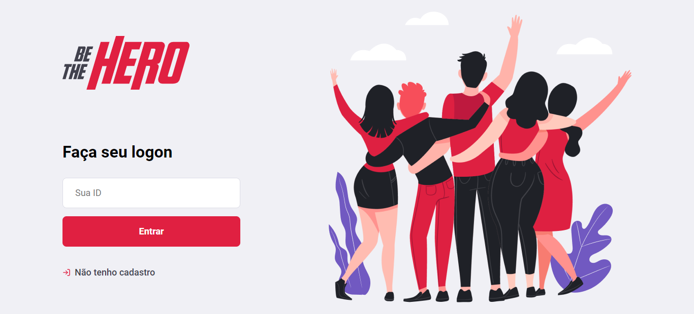
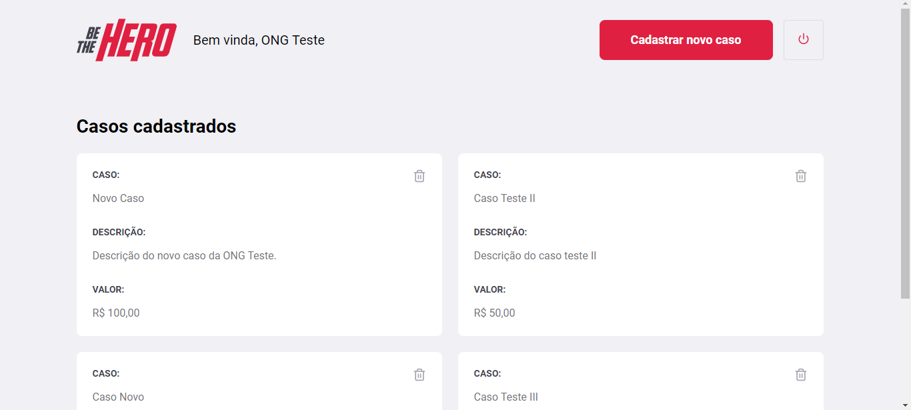
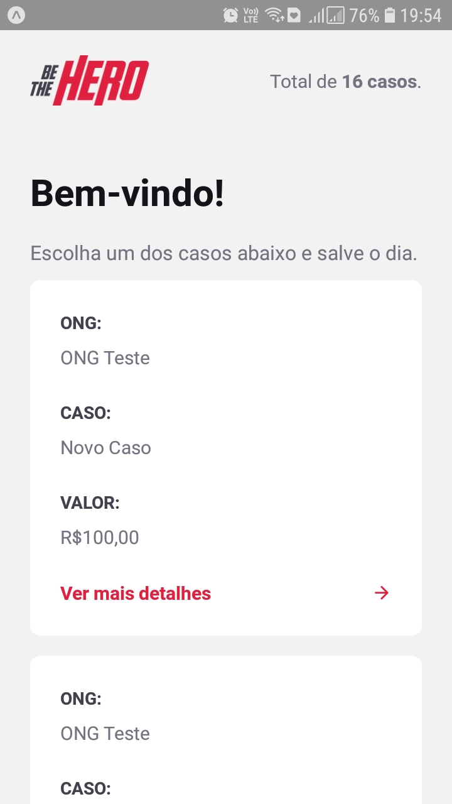
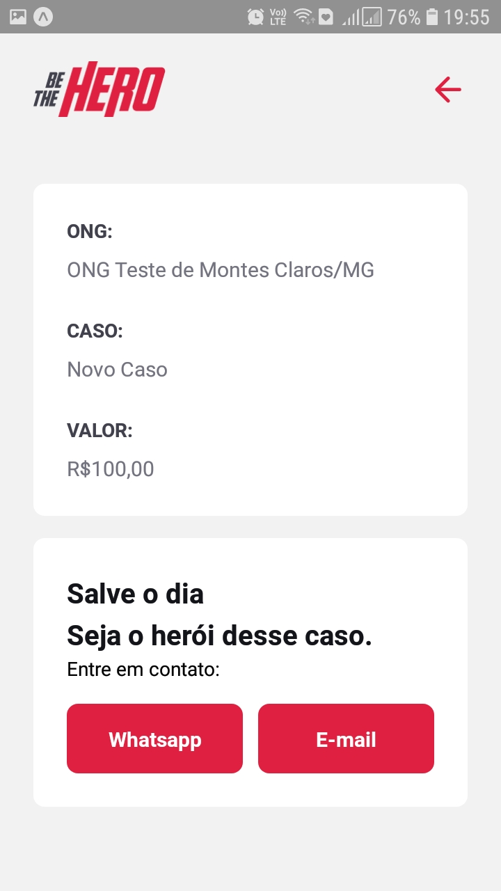

  
  
  <h3> 🚀 Resultado da Semana OmniStack 11</h3>

  <a href="#project">Projeto</a>&nbsp;&nbsp;&nbsp;|&nbsp;&nbsp;&nbsp;
  <a href="#img">Imagens</a>&nbsp;&nbsp;&nbsp;|&nbsp;&nbsp;&nbsp;
  <a href="#techs">Tecnologias</a>

 

<h2 id="project"> 📌  Projeto </h2>
Este projeto foi realizado visando auxiliar ONGs a terem visibilidade em seus casos, facilitando a obtenção de doações.

Com o [Be The Hero](https://github.com/LorraneAlkimim/Be-The-Hero) as ONG's podem publicar seus casos pelo site, inserindo informações detalhadas sobre ele e um valor para doação.

Através do aplicativo mobile é possível visualizar todos os casos cadastrados e entrar em contato com a ONG pelo e-mail ou Whatsapp.

 

<h2 id="img"> 📷  Imagens </h2>

Telas Web:

&nbsp;

&nbsp;

Telas Mobile:

 &nbsp;

 

<h2 id="techs"> 💻  Tecnologias </h2>
Esse projeto foi desenvolvido com as seguintes tecnologias:

- [Node.js](https://nodejs.org/en/)
- [React](https://reactjs.org)
- [React Native](https://facebook.github.io/react-native/)
- [Expo](https://expo.io/)
- [Express](https://expressjs.com/pt-br/)
- [Nodemon](https://www.npmjs.com/package/nodemon)
- [Axios](https://www.npmjs.com/package/axios)
- [Cors](https://www.npmjs.com/package/cors)
- [Jest](https://www.npmjs.com/package/jest)
- [Knex](http://knexjs.org/)

